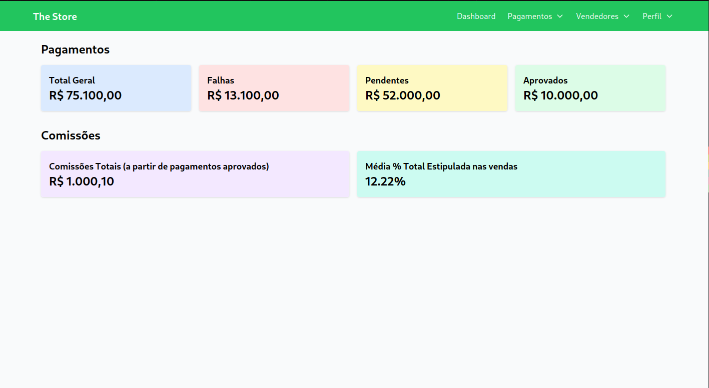
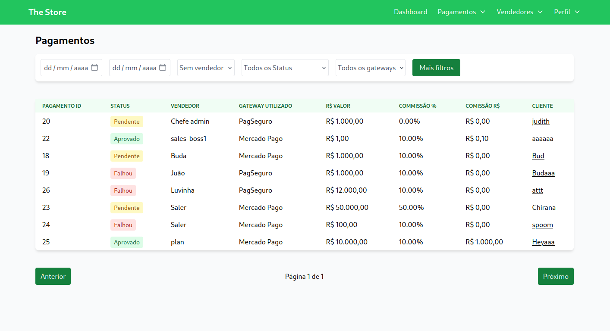
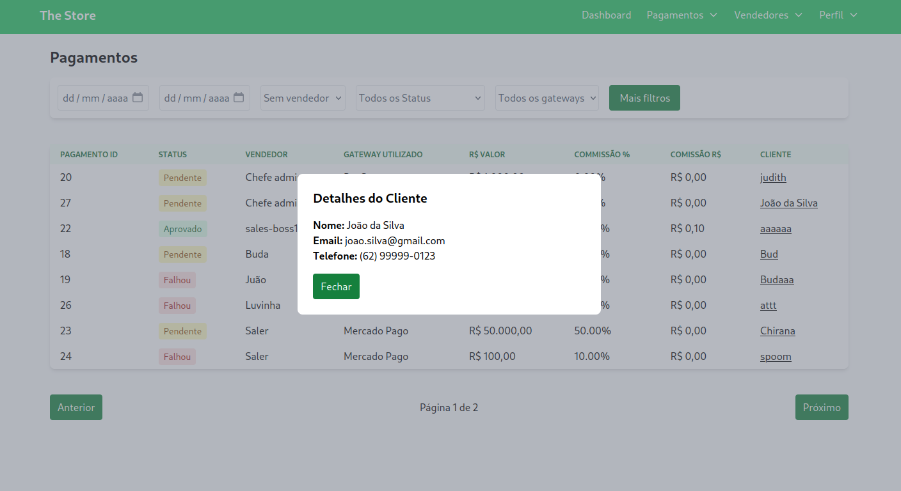
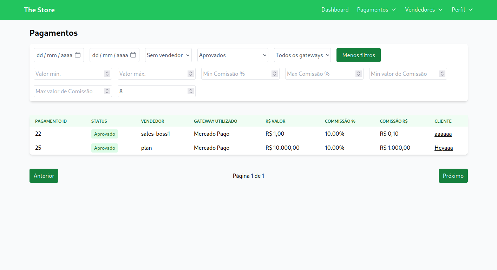
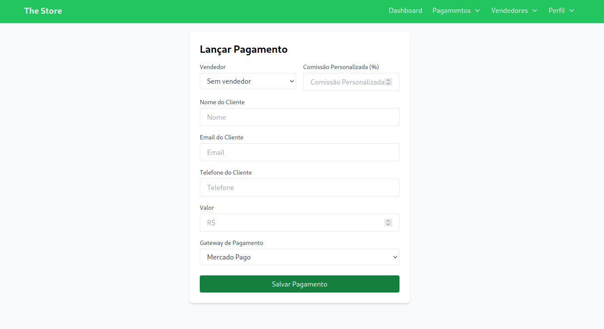
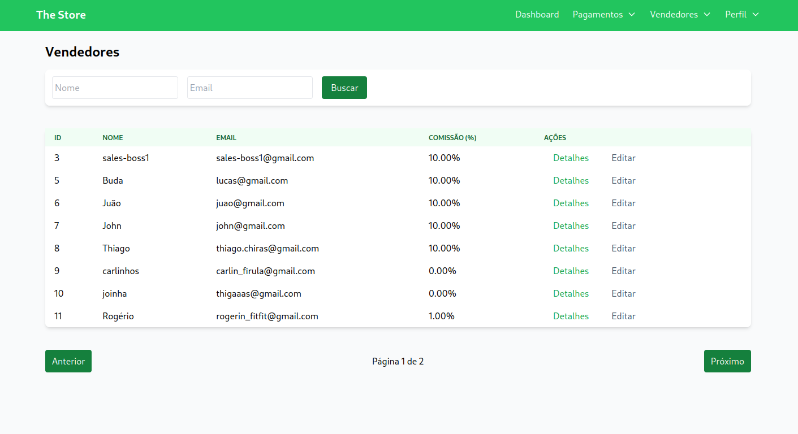
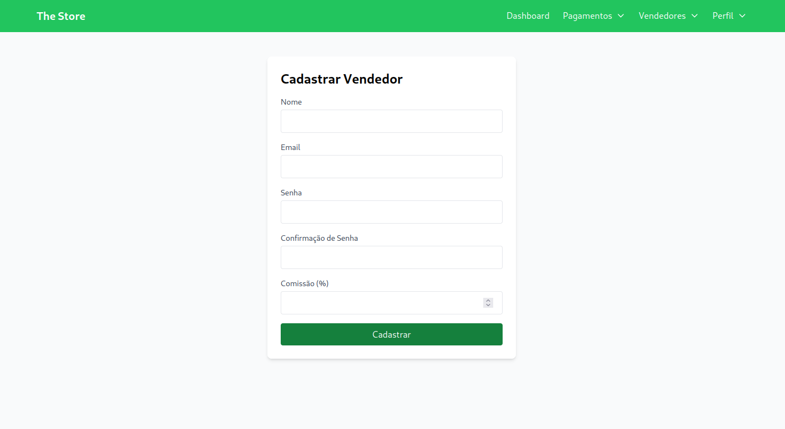

# Projeto de Gestão de Vendedores e Pagamentos (The Store) - Frontend

Este projeto faz parte de uma aplicação para a gestão de vendedores e pagamentos, com controle de acesso baseado em diferentes perfis de usuários, como **Lojista** e **Vendedor**. A aplicação permite que os usuários acessem informações dinâmicas relacionadas ao seu papel (como visualização e cadastro de vendedores e pagamentos). Esta parte é o **Frontend** do projeto.

## Funcionalidades

- **Login de Usuário**: Autenticação baseada em **JWT**.
- **Gestão de Vendedores**: Permite que **Lojistas** vejam e cadastrem **Vendedores**.
- **Gestão de Pagamentos**: **Vendedores** podem visualizar seus **pagamentos**.
- **Controle de Acesso**: Diferentes níveis de acesso para **Lojistas** e **Vendedores**.

## Tecnologias Utilizadas

- **React**: Para a construção da interface do usuário.
- **Redux Toolkit**: Para o gerenciamento de estado e controle de fluxo da aplicação.
- **Axios**: Para realizar as requisições HTTP ao backend.
- **React Router**: Para gerenciamento das rotas da aplicação.
- **Tailwind CSS**: Para estilização da interface de forma ágil e responsiva.
- **JWT (JSON Web Token)**: Para gerenciar autenticação e autorização no frontend.

## Como Rodar o Projeto

### Antes, você vai precisar...

Ter o [Node.js](https://nodejs.org/) instalado na sua máquina. Após isso, siga os passos abaixo:

1. Clone o repositório:
    ```bash
    git clone https://github.com/thiagochirana/the-store-frontend.git
    cd the-store-frontend
    ```

2. Instale as dependências:
    ```bash
    npm install
    ```

3. Inicie o servidor:
    ```bash
    npm run dev
    ```

O projeto estará acessível em [http://localhost:5000](http://localhost:5000).

## Arquitetura do Projeto

O projeto segue uma arquitetura `Feature-Based`, onde o código é organizado por funcionalidades (features) principais, com componentes, lógica de estado e serviços relacionados a cada domínio agrupados em pastas específicas. Isso facilita a manutenção e a escalabilidade da aplicação.

  - **components**: Contém os componentes reutilizáveis da interface, como cabeçalhos, formulários e tabelas.
  - **features**: Agrupa a lógica das funcionalidades principais, como autenticação e gestão de vendedores e pagamentos, utilizando Redux para gerenciar o estado.
  - **pages**: Contém as páginas principais da aplicação, cada uma composta por diversos componentes.
  - **services**: No momento contém apenas um handle usando axios para realizar requests ao backend.
  - **store**: Configuração do Redux, com slices para cada funcionalidade (autenticação, vendedores, pagamentos).
  - **router**: Gerencia as rotas da aplicação, incluindo rotas protegidas conforme o perfil do usuário.

Busquei deixar o mais próximo de modular, para que consiga fazer reuso e assim permitindo fácil manutenção e expansão do sistema.

## Alguns prints













